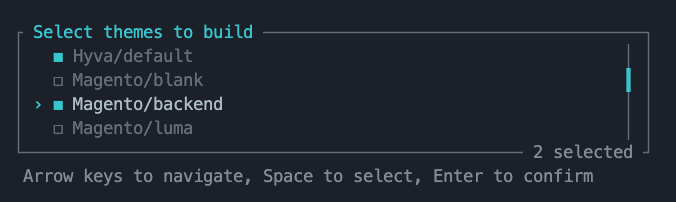

# MageForge for Magento 2


[](https://app.codacy.com/gh/OpenForgeProject/mageforge/dashboard?utm_source=gh&utm_medium=referral&utm_content=&utm_campaign=Badge_grade)  [](https://www.codefactor.io/repository/github/openforgeproject/mageforge)

MageForge is a powerful CLI front-end development toolkit for Magento 2 that simplifies theme development workflows. It provides tools for many types of Magento themes and can be easily extended for your custom theme. With MageForge, themes can be built lightning fast, without your developers having to worry about the details. MageForge eliminates complex configuration requirements and significantly reduces setup time, allowing Magento developers to focus on creative aspects instead of struggling with build processes.

[](https://discord.gg/H5CjMXQQHn)

## Supported Magento Versions

MageForge requires Magento 2.4.7 or higher.
Please ensure that your Magento installation meets this requirement before installation.

## Features


### Supported Theme-Types 🎨



| Theme Type | Support Status |
|------------|----------------|
| 🎯 Magento Standard | ✅ Fully Supported |
| 🚀 Hyvä | ✅ Fully Supported |
| 🔄 Hyvä Fallback | ✅ Fully Supported |
| 🎨 Custom TailwindCSS (no Hyvä) | ✅ Fully Supported |
| 💼 Avanta B2B | ✅ Fully Supported |
| 🥰 Your Custom Theme | [Create your own Builder](./docs/custom_theme_builders.md) |

---

### Available Commands

| Command                    | Description                                                 | Shortcodes                         |
|---------------------------|-------------------------------------------------------------|-----------------------------------|
| `mageforge:system:version`       | Shows current and latest version of the module             | `m:s:v`                            |
| `mageforge:system:check`  | Get system information (OS, PHP, Database, Node.js, etc.)     | `m:s:c`                            |
| `mageforge:theme:list`    | Lists all available themes                                 | `m:t:l`                            |
| `mageforge:theme:build`   | Builds selected themes (CSS/TailwindCSS)                   | `m:t:b`, `frontend:build`          |
| `mageforge:theme:watch`   | Starts watch mode for theme development                    | `m:t:w`, `frontend:watch`          |
| `mageforge:hyva:tokens`   | Generates Hyvä design tokens CSS from token definitions    | `m:h:t`                            |


---

## Getting Started

### Installation

1. Install the module via Composer:
   ```bash
   composer require openforgeproject/mageforge
   ```

2. Enable the module:
   ```bash
   bin/magento module:enable OpenForgeProject_MageForge
   bin/magento setup:upgrade
   ```

### Quick Start Guide

1. List available themes:
   ```bash
   bin/magento mageforge:theme:list
   ```

2. Build a theme:
   ```bash
   bin/magento mageforge:theme:build <theme-code>
   ```
   Example: `bin/magento mageforge:theme:build Magento/luma`

3. Start development watch mode:
   ```bash
   bin/magento mageforge:theme:watch <theme-code>
   ```

4. Enjoy automatic CSS rebuilding you work on your theme files!

## Additional Documentation

- [Advanced Usage Guide](./docs/advanced_usage.md) - Tips, tricks and troubleshooting
- [Custom Theme Builders Documentation](./docs/custom_theme_builders.md) - Extend MageForge for your custom themes
- [Commands Documentation](./docs/commands.md) - Detailed command reference

## Community & Support

- **Report Bugs/Features**: [GitHub Issues](https://github.com/OpenForgeProject/mageforge/issues)
- **Get Help**: [Discord Community](https://discord.gg/H5CjMXQQHn)
- **Contributing**: See [Contributing Guidelines](./CONTRIBUTING.md)

## Project Information

- **License**: [LICENSE](LICENSE)
- **Changelog**: [CHANGELOG](CHANGELOG.md)

---

Thank you for using MageForge!
