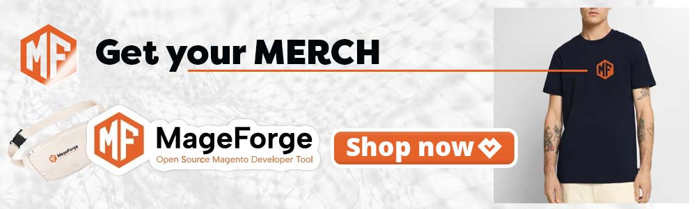
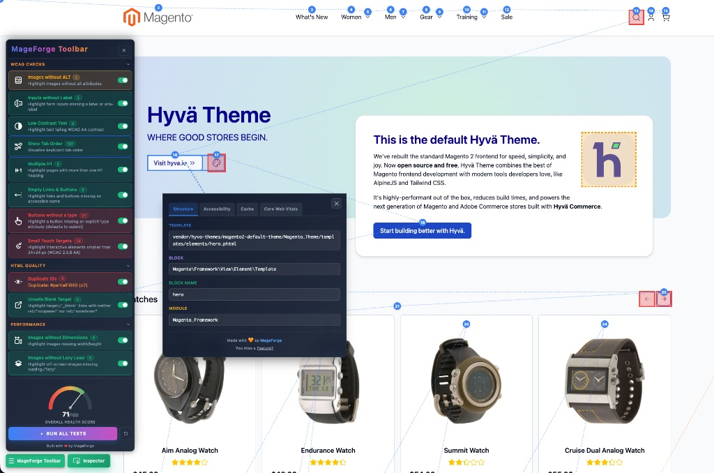

# MageForge for Magento 2


[](https://github.com/OpenForgeProject/mageforge/releases) [](LICENSE)

MageForge is a powerful CLI toolkit for Magento 2 front-end development. It simplifies theme building workflows, supports multiple theme types (Magento Standard, Hyvä, TailwindCSS, custom), and includes developer tools like the Frontend Inspector.

## Get your Merch

[](https://mageforge.myspreadshop.de/)

## Table of Contents

- [Requirements](#requirements)
- [Supported Theme Types](#supported-theme-types)
- [Installation](#installation)
- [Quick Start](#quick-start)
- [Frontend Inspector](#frontend-inspector)
- [Commands Reference](#commands-reference)
- [Documentation](#documentation)
- [Get your Merch](#get-your-merch)
- [Credits](#credits)

> **Contributor?** Jump to the [Development Guide](./docs/development.md).

## Requirements

- Magento 2.4.7+ (tested on 2.4.7-p10, 2.4.8-p5, 2.4.9)
- PHP 8.3+
- Node.js (LTS recommended)
- Composer

## Supported Theme Types

| Theme Type                      | Support Status                                             |
| ------------------------------- | ---------------------------------------------------------- |
| Magento Standard                | ✅ Supported                                              |
| Hyvä (TailwindCSS 3.x / 4.x)  | ✅ Supported                                              |
| Hyvä Checkout                   | ✅ Supported                                              |
| Hyvä Fallback                   | ✅ Supported                                              |
| Custom TailwindCSS (no Hyvä)    | ✅ Supported                                              |
| Avanta B2B                      | ✅ Supported                                              |
| Your Custom Theme               | [Create your own Builder](./docs/custom_theme_builders.md) |

## Installation

1. Install via Composer:

   ```bash
   composer require openforgeproject/mageforge
   ```

2. Enable the module:

   ```bash
   bin/magento module:enable OpenForgeProject_MageForge
   bin/magento setup:upgrade
   ```

## Quick Start

```bash
# 1. List available themes
bin/magento mageforge:theme:list

# 2. Build a theme
bin/magento mageforge:theme:build Magento/luma

# 3. Watch for changes (development mode)
bin/magento mageforge:theme:watch Magento/luma
```

See [Commands Reference](./docs/commands_reference.md) for the full command list with options and examples.

## Frontend Inspector

The MageForge Inspector lets you inspect Magento blocks, templates, and performance metrics directly in your browser.

**Features:**
- Template paths, block classes, and module names
- PHP render times and cache status (lifetime, tags)
- Web Vitals: LCP, CLS, INP per element
- Accessibility checks: ARIA roles, contrast ratios, alt text

#### Screenshot


**Enable:**
```bash
bin/magento mageforge:theme:inspector enable
```
*(Requires Developer Mode. Can also be enabled in Admin: `Stores > Configuration > MageForge > Frontend Inspector`)*

**Use in Browser:**
- Toggle: `Ctrl+Shift+I` (Windows/Linux) or `Cmd+Option+I` (macOS)
- Hover over elements to inspect; click to lock on a specific block

> **Note:** Not compatible with Magewire components (automatically excluded).

## Commands Reference

See the dedicated [Commands Reference](./docs/commands_reference.md) for complete documentation of all MageForge commands, including:

- Theme commands (`list`, `build`, `watch`, `clean`, `inspector`)
- Hyvä commands (`tokens`, `compatibility:check`)
- System commands (`version`, `check`)
- Options, arguments, and usage examples

## Documentation

- [Commands Reference](./docs/commands_reference.md) — Full command documentation
- [Custom Theme Builders](./docs/custom_theme_builders.md) — Extend MageForge for custom themes
- [Development Guide](./docs/development.md) — Local dev setup, workflow, and contribution guide

## Get your Merch

[](https://mageforge.myspreadshop.de/)

## Support

- **Bugs / Features:** [GitHub Issues](https://github.com/OpenForgeProject/mageforge/issues)
- **Discussions:** [GitHub Discussions](https://github.com/OpenForgeProject/mageforge/discussions)
- **Contributing:** See [Contributing Guidelines](./CONTRIBUTING.md)


## Credits

MageForge uses the following third-party libraries:

| Library | Author | License |
| ------- | ------ | ------- |
| [Tabler Icons](https://tabler.io/icons) | codecalm | [MIT](https://github.com/tabler/tabler-icons/blob/main/LICENSE) |

---

## Special Thanks

A big thank you to **[e3n-team](https://github.com/e3n-team)** for their continuous support and collaboration in the further development of MageForge.

Your contributions have been invaluable!

---

Thank you for using MageForge!
