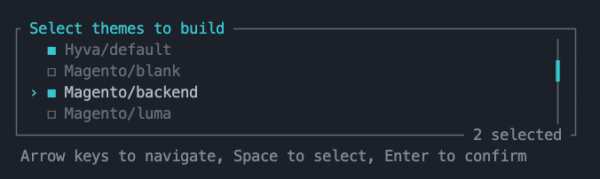

# MageForge for Magento 2


[](https://github.com/OpenForgeProject/mageforge/releases) [](LICENSE)

MageForge is a powerful CLI front-end development toolkit for Magento 2 that simplifies theme development workflows. It provides tools for many types of Magento themes and can be easily extended for custom themes.

## Table of Contents

- [Supported Magento Versions](#supported-magento-versions)
- [Features](#features)
  - [Supported Theme-Types](#supported-theme-types-)
  - [Available Commands](#available-commands)
- [Getting Started](#getting-started)
  - [Installation](#installation)
  - [Quick Start Guide](#quick-start-guide)
  - [Frontend Inspector](#frontend-inspector-️)
- [Additional Documentation](#additional-documentation)
- [Support](#support)
- [Project Information](#project-information)
- [Credits](#credits)

## Supported Magento Versions

MageForge requires Magento 2.4.7 or higher with PHP 8.3 or higher.
Please ensure that your Magento installation meets this requirement before installation.

## Features

### Supported Theme-Types 🎨



| Theme Type                      | Support Status                                             |
| ------------------------------- | ---------------------------------------------------------- |
| 🎯 Magento Standard             | ✅ Fully Supported                                         |
| 🚀 Hyvä (TailwindCSS 3.x / 4.x) | ✅ Fully Supported                                         |
| 🔄 Hyvä Fallback                | ✅ Fully Supported                                         |
| 🎨 Custom TailwindCSS (no Hyvä) | ✅ Fully Supported                                         |
| 💼 Avanta B2B                   | ✅ Fully Supported                                         |
| 🥰 Your Custom Theme (`css`, `sass`, `less`, ... )           | [Create your own Builder](./docs/custom_theme_builders.md) |

---

### Available Commands

| Command                             | Description                                               | Aliases                   |
| ----------------------------------- | --------------------------------------------------------- | ------------------------- |
| `mageforge:theme:list`              | Lists all available themes                                | `frontend:list`           |
| `mageforge:theme:build`             | Builds selected themes (CSS/TailwindCSS)                  | `frontend:build`          |
| `mageforge:theme:watch`             | Starts watch mode for theme development                   | `frontend:watch`          |
| `mageforge:theme:clean`             | Clean theme static files and cache directories            | `frontend:clean`          |
| `mageforge:theme:inspector`         | Enable, disable or check status of Frontend Inspector     | -                         |
| `mageforge:hyva:compatibility:check`| Check modules for Hyvä theme compatibility issues         | `hyva:check`              |
| `mageforge:hyva:tokens`             | Generate Hyvä design tokens (Hyvä themes only)            | `hyva:tokens`             |
| `mageforge:system:version`          | Shows current and latest version of the module            | `system:version`          |
| `mageforge:system:check`            | Get system information (OS, PHP, Database, Node.js, etc.) | `system:check`            |

## Frontend Toolbar with Inspector and Performance Metrics


## Getting Started

### Installation

1. Install the module via Composer:

   ```bash
   composer require openforgeproject/mageforge
   ```

2. Enable the module:
   ```bash
   bin/magento module:enable OpenForgeProject_MageForge
   bin/magento setup:upgrade
   ```

### Quick Start Guide

1. List available themes:

   ```bash
   bin/magento mageforge:theme:list
   ```

2. Build a theme:

   ```bash
   bin/magento mageforge:theme:build <theme-code>
   ```

   Example: `bin/magento mageforge:theme:build Magento/luma`

3. Start development watch mode:

   ```bash
   bin/magento mageforge:theme:watch <theme-code>
   ```

4. Generate Hyvä design tokens (for Hyvä themes):

   ```bash
   bin/magento mageforge:hyva:tokens <theme-code>
   ```

   This creates a `generated/hyva-tokens.css` file from your design tokens configuration.

5. Enjoy automatic CSS rebuilding as you work on your theme files!

---

### Frontend Inspector 🕵️

The **MageForge Inspector** is a powerful developer tool that allows you to inspect Magento blocks, templates, and performance metrics directly in your browser.

**Key Features:**
- **Structure Analysis**: View template paths, block classes, and module names for any element.
- **Performance Metrics**: See PHP render times and cache status (lifetime, tags).
- **Web Vitals**: Monitor LCP, CLS, and INP metrics per element.
- **Accessibility Checks**: Inspect ARIA roles, contrast ratios, and alt text.

**How to use:**

1. **Enable the Inspector in the CLI**:
   ```bash
   bin/magento mageforge:theme:inspector enable
   ```
   *(Note: Requires Magento Developer Mode)*

2. **Enable the Inspector in Magento Admin Settings**
You can activate the Inspector in Magento Admin under `Stores > Configuration > MageForge > Frontend Inspector`.

3. **Usage in Browser**:
   - **Toggle**: Press `Ctrl+Shift+I` (Windows/Linux) or `Cmd+Option+I` (macOS).
   - **Inspect**: Hover over elements to see details. Click to lock the inspector on a specific block.

To disable the inspector:
```bash
bin/magento mageforge:theme:inspector disable
```

> **Note:** The Inspector is currently not compatible with **Magewire** components. Magewire blocks are automatically excluded from inspection to prevent rendering errors.

---

## Additional Documentation

- [Advanced Usage Guide](./docs/advanced_usage.md) - Tips, tricks and troubleshooting
- [Custom Theme Builders Documentation](./docs/custom_theme_builders.md) - Extend MageForge for your custom themes
- [Commands Documentation](./docs/commands.md) - Detailed command reference

## Support

- **Report Bugs/Features**: [GitHub Issues](https://github.com/OpenForgeProject/mageforge/issues)
- **Discussions**: [GitHub Discussions](https://github.com/OpenForgeProject/mageforge/discussions)
- **Contributing**: See [Contributing Guidelines](./CONTRIBUTING.md)

## Project Information

- **License**: [LICENSE](LICENSE)
- **Changelog**: [CHANGELOG](CHANGELOG.md)

## Credits

MageForge uses the following third-party libraries:

| Library | Author | License |
| ------- | ------ | ------- |
| [Tabler Icons](https://tabler.io/icons) | codecalm | [MIT](https://github.com/tabler/tabler-icons/blob/main/LICENSE) |

---

Thank you for using MageForge!
